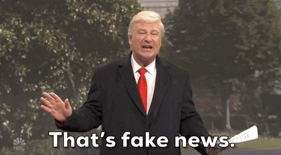
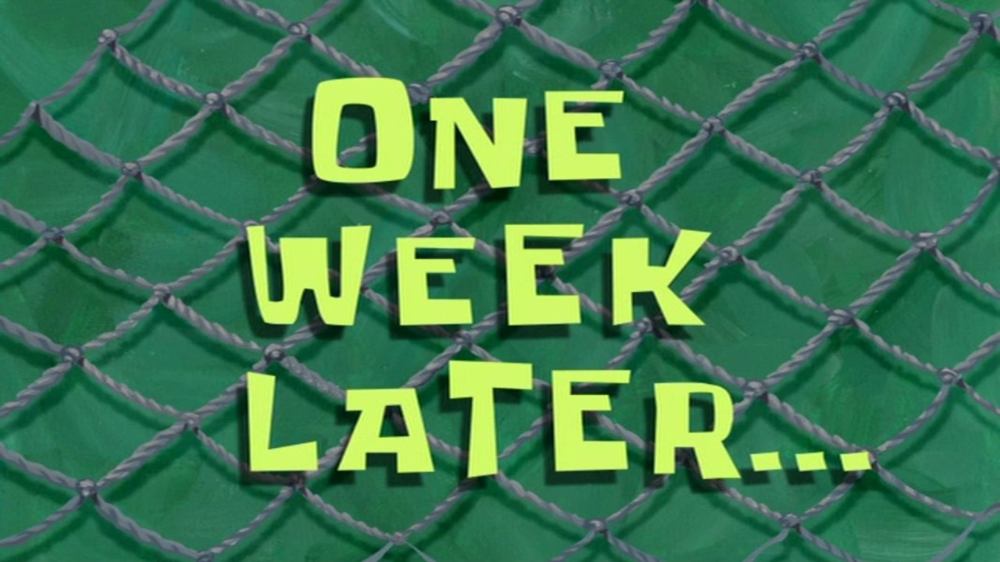

<h1 align="center">
  CovFeFake
</h1>

  

<h1 align="center">
  
</h1>

<h1 align="center">
  Are you tired of FAKE COVID NEWS?
</h1>

  

# Well fear Not, Jina is here to help you out!

## This project uses the powerful and flexible Neural Search API, aka, <a href="https://github.com/jina-ai/jina">Jina</a> to keep you informed about the authenticity of Covid News!

### Is Bob from Twitter correct when tweets "Injecting soap cures covid!"?
### Or when he tweets "Drinking corona beer gon give you corona guys!"?

<h1 align="center">
  Well let's ask Jina!
</h1>

<h1 align="center">
  Jina thinks this news is fishy!  
</h1>

### Phew, almost injected myself with soap. Thanks Jina! Gotta tell Bob to stop spreading fake news!

### Well its been a week now, and it looks like Bob has started posting authentic news now.
### But let's ask Jina just to be sure!

<h1 align="center">
  Jina thinks this news seems true!  
</h1>

##  Well it looks like Bob really has turned over a new leaf!  

